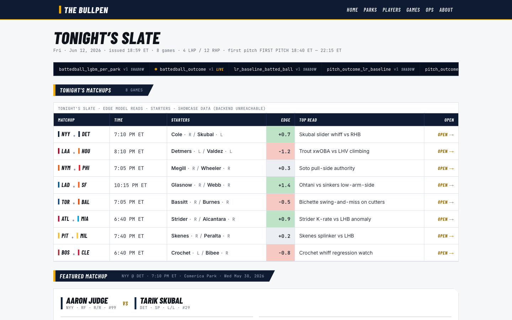
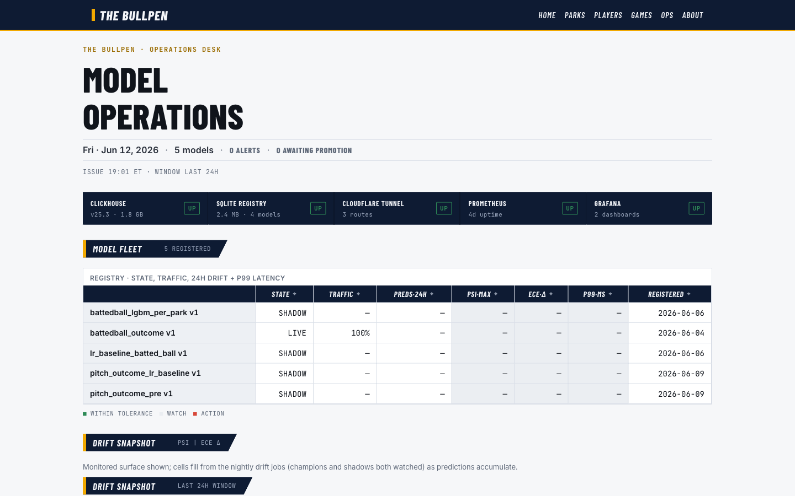
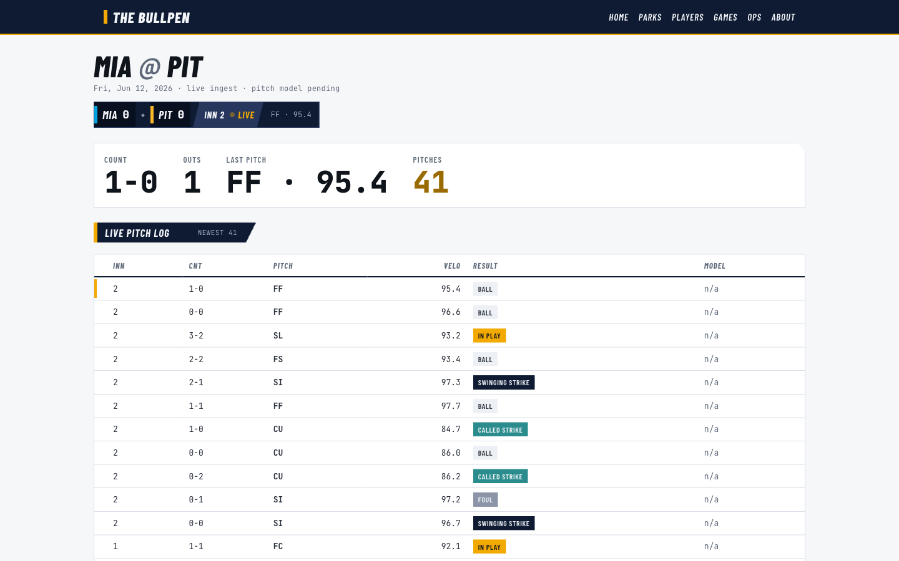
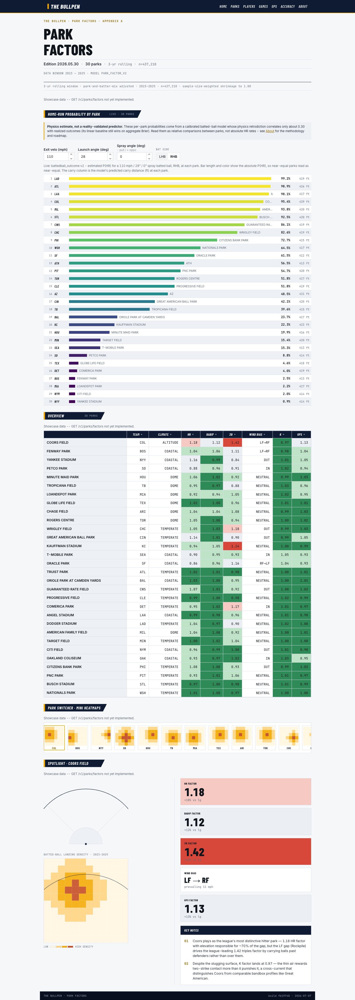
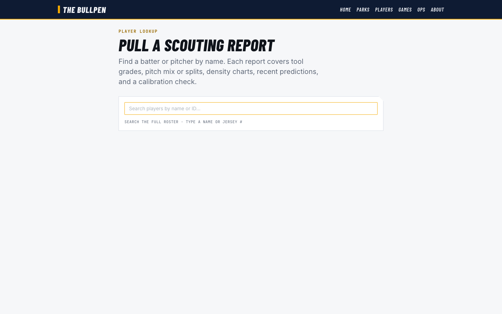
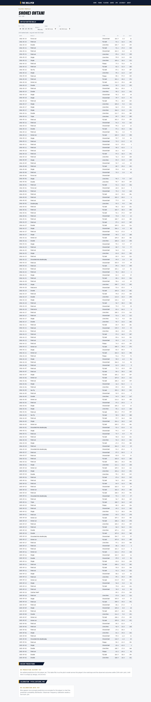
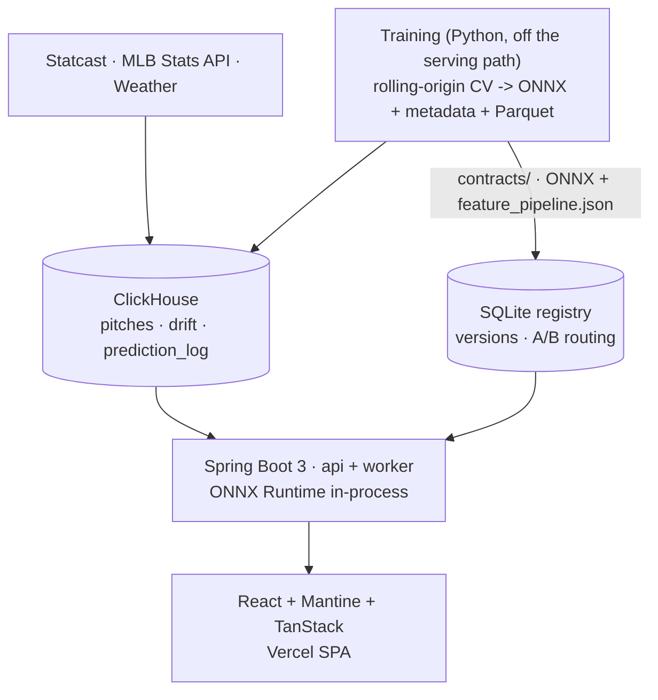
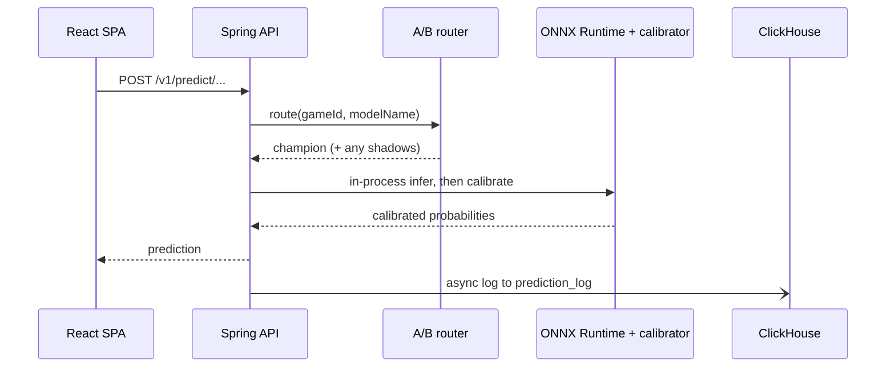

# The Bullpen

A self-hosted baseball-analytics platform built primarily as an ML-systems +
serving wrapper (registry, shadow-mode A/B routing, drift jobs, retraining queue) around three
calibrated models, of which one reaches a browser today: a batted-ball champion serving live (a
per-park calibrated physics estimate, honest about its reality gap - see the cross-park limitation
below), with two pitch-outcome heads not yet serving any user-visible prediction (post is
champion-stage but UI-held, pre stays shadow on a failed primary - decisions [154]/[165]). Built to
operate through at least one MLB season for a real drift postmortem (the in-season postmortem is
pending; a synthetic induced-drift drill stands in for now).

- **Live site**: https://thebullpen.net/
- **Ops dashboard**: https://thebullpen.net/ops
- **About + methodology**: https://thebullpen.net/about
- **Repo**: https://github.com/Alexm-picard/the-bullpen

> **What's live vs. showcase (v1):** most of the app pulls real data from the Spring
> backend - the per-game detail view (`/games/:id`), the player lookup + `/players/:id`
> profile, the `/parks` HR-by-park heatmap, the home tonight slate, and the Ops dashboard's
> Model Fleet / latency / retrain queue / ops log (live via `/v1/ops/*`, with a committed-fixture
> fallback when those are empty or offline). Still pure showcase from `*-fixtures.ts`: the
> `/parks` factor table, the About methodology page, and the Ops drift-snapshot skeleton.
> See _Known limitations_ for the honest caveats.

## What's interesting about it

- A **custom ML systems wrapper** - model registry, A/B router (shadow-mode),
  drift detection, retraining queue + triggers (dispatch wired for the served
  batted-ball head and **proven end-to-end on real data**: one queued trigger
  retrained the served model on ~1.2M batted balls and registered the candidate
  in 96.8 unattended minutes; the other registry names stay explicit
  UnsupportedModel) - written from scratch in Java rather than pulled in via
  MLflow. The wrapper is the project; the models are the excuse.
- **ONNX Runtime in-process** in Java + Spring Boot 3 - no Python
  sidecar, no live RPC. Training is Python; serving is JVM.
- **Broadcast-graphics design system** (Barlow Condensed / Inter /
  JetBrains Mono, scorebug + lower-third telecast chrome). The product is
  advance-scouting analytics, so it presents as a live-broadcast package,
  not yet-another-SaaS chrome (decision [160], superseding the earlier
  scouting-report identity [133]).
- **Per-model eval artifact** with rolling-origin cross-validation,
  reliability diagrams, calibration metrics - always co-registered with
  a logistic-regression baseline to bound the neural model's lift.
- A **drift -> postmortem** chain (automated trigger, human promotion gate -
  decision [44] / rule 6), validated end-to-end by a synthetic induced-drift
  drill; the first real in-season postmortem is pending.
- **Measured test coverage**, not a vibe: 700+ backend test methods, 600+ Python
  tests (including the four required temporal-leakage tests, mutation-checked),
  and 400+ frontend tests. Line/branch coverage is published every CI run and
  gated on a regression floor (backend JaCoCo under the Docker ITs; frontend
  vitest v8; training coverage.py) - read the current numbers from the latest run
  rather than figures pasted here, which drift (the thresholds live in
  `build.gradle.kts`, `vite.config.ts`, and `pyproject.toml`).
  Every commit also gates on lint, hex-codes, bundle-budget, a real axe-core a11y
  gate, and a Schemathesis API-contract check.

## Screenshots

The live site ([thebullpen.net](https://thebullpen.net)):

|                                Tonight's slate                                 |                                         Ops dashboard                                         |
| :----------------------------------------------------------------------------: | :-------------------------------------------------------------------------------------------: |
|   [](docs/screenshots/home.png)   |            [](docs/screenshots/ops.png)             |
|                                 **Live game**                                  |                                     **Park HR explorer**                                      |
|      [](docs/screenshots/game.png)      |   [](docs/screenshots/parks-full.jpeg)   |
|                               **Player search**                                |                                      **Player profile**                                       |
| [](docs/screenshots/players.png) | [](docs/screenshots/player-ohtani.jpeg) |

## How to try it

The simplest path is the live site above. To run it locally:

```bash
# 1. Stateful services (ClickHouse, Prometheus, Grafana). The ClickHouse container is
#    FAIL-CLOSED since decision [161] - it refuses to start without a password - so seed the
#    env FIRST, then bring the services up via the Makefile target (it renders the ClickHouse
#    users file and passes --env-file). A bare `docker compose up` fails on the required :? vars.
cp infra/.env.example infra/.env      # then set BULLPEN_CLICKHOUSE_PASSWORD + GRAFANA_ADMIN_PASSWORD
make services-up                      # render-users.sh + docker compose --env-file infra/.env up -d

# 2. Backend (api profile on 8080, worker on 8081). The Gradle wrapper lives in backend/, not root.
cd backend && ./gradlew bootRun --args='--spring.profiles.active=api'

# 3. Frontend (Vite on 5173, calls Spring via CORS)
cd ../frontend && npm install && npm run dev

# 4. Training - run the test suite (OMP_NUM_THREADS=1 avoids a macOS libomp segfault)
cd ../training && uv sync && OMP_NUM_THREADS=1 uv run python -m pytest
```

**What works with an empty stack.** The backend boots against an empty ClickHouse with no
registered ONNX model: the predict endpoints return a documented `503` (no live champion, not a
crash), and every read surface (`/v1/ops/*`, players, parks, games) falls back to committed
fixtures - so the SPA and the Ops dashboard render end-to-end before you have any data or models.
Real predictions need the historical Statcast pull plus a trained-and-registered model, which is
the self-hosted box workflow (ADR-0006), not the local quickstart.

## Training the models

Five registry artifacts - three outcome models (pre-pitch head, post-pitch
head, batted-ball MLP; the batted-ball head serves live, the two pitch heads
are shadow) plus their two baselines (pitch LR, batted-ball LGBM). Training runs on the self-hosted desktop only (ADR-0006: it needs
the full 2015–2025 ClickHouse dataset and the GPU); the Mac runs a sampled
iteration loop. **2026 is holdout-only** (rule 13).

**All at once** - from `training/`, the full sequence (feature table →
pitch heads + baselines → batted-ball pipeline):

```bash
# 0. Feature table
uv run python -m bullpen_training.features.tier_1_2   --min-year 2015 --max-year 2025
uv run python -m bullpen_training.features.tier_3_form --min-year 2015 --max-year 2025
# 1–3. Pitch heads + LR baseline (+ ONNX export for the LightGBM heads)
uv run python -m bullpen_training.pitch.production --model lightgbm   # → pitch_outcome_pre
uv run python -m bullpen_training.pitch.production --model post       # → pitch_outcome_post
uv run python -m bullpen_training.pitch.production --model lr         # → LR baseline
# 4–5. Batted-ball MLP + LGBM baseline (retrodict → MLP → calibrators → gate → LGBM → compare)
bash scripts/run_2c_overnight.sh
```

**In sections** - every step above is independent and idempotent, so on a
box that thermal-throttles you run one, let it cool, run the next; the
batted-ball orchestrator is itself sectionable stage-by-stage. The full
procedure - prerequisites, per-stage heat/time table, cooldown cut-points,
gates, and registration - lives in
[`docs/runbooks/training-models.md`](docs/runbooks/training-models.md)
(batted-ball detail in
[`2c-overnight-pipeline.md`](docs/runbooks/2c-overnight-pipeline.md)).

## Design + decisions

Most "obvious" alternatives have been rejected with written rationale -
check before re-litigating:

- [System design](docs/design.md) - every locked technical choice with
  context.
- [Numbered decisions log](docs/decisions.md) - chronological append-only
  flat log.
- [Phased build plan](docs/plan.md) - Phase 0 → Phase 5, soft-cut
  priority list, two-week review cadence.
- [`CLAUDE.md`](CLAUDE.md) - non-negotiable discipline rules.
- ADRs (long-form, top ~15 % of decisions): [`docs/adr/`](docs/adr/)

### Architecture



A single prediction request (the serving hot path is ClickHouse-free; logging is
async, off the response path):



## Data sources + licensing

The code in this repository is released under the [MIT License](LICENSE). That
covers the code only - it grants no rights to the underlying MLB data, whose
terms are separate (see below).

Pitch-level data is downloaded from
[Baseball Savant](https://baseballsavant.mlb.com/) via the
[`pybaseball`](https://pypi.org/project/pybaseball/) client. Roster and
game schedule come from the MLB Stats API. Weather joins from a free
meteorology source.

**This project's published outputs (predictions, model artifacts, this
site) are derived analytics for personal research / portfolio purposes.
Underlying play-by-play data is not redistributed.**

## Known limitations

- **Live vs. showcase is now mixed** (v1). Hitting the backend live: `/games/:id`,
  the player lookup + `/players/:id` profile (recent predictions + reliability
  diagram), the `/parks` HR-probability-by-park heatmap, the home page's tonight
  slate, and the Ops dashboard's Model Fleet / latency / retrain queue / ops log
  (live via `/v1/ops/*`, falling back to committed fixtures only when those return
  empty or the backend is offline). Still pure showcase from
  `frontend/src/data/*-fixtures.ts`: the `/parks` factor table, the About
  methodology page, and the Ops drift-snapshot panel (fixtures - the drift-detection
  jobs that write `drift_metrics` are real, see below, but no user-facing drift-read
  endpoint feeds this panel yet).
- **Cross-park batted-ball fidelity is a known limitation.**
  `/v1/predict/batted-ball/all-parks` is served by the registered batted-ball
  champion across the 30 parks. The ball-flight physics validation passes (bias
  -0.14 ft, 93 % of fixtures within tolerance) - but that is **still-air carry
  reconstruction**, not real-weather cross-park fidelity. The cross-park HR-ordering
  sanity gate does **not** pass yet: predicted per-park HR rates correlate only
  Spearman rho ~0.29 with the known park-factor ordering (gate target 0.80). The
  away-park counterfactual currently uses ADR-0010's **still-air interim**
  (destination seasonal temp/density + altitude, **no wind**); the real per-date
  weather + wind backfill (`park_daily_weather`) that should lift the ordering is
  staged but not yet shipped. Treat per-park batted-ball numbers as directional, not
  calibrated, until that gate is green - see
  [`docs/cross-park-fidelity-plan.md`](docs/cross-park-fidelity-plan.md). The `/parks` heatmap and
  the About page surface this physics-estimate framing (and the rho gap) directly to users rather
  than presenting raw P(HR) as fact (decision [163]).
- **Automated retraining is wired AND proven on real data** (BOX HAND-OFF #1,
  2026-07-15). A manually-enqueued trigger drove the full production path
  unattended: claim -> 11 per-year ClickHouse loads (~1.2M batted balls;
  train 2015-2024, calibration on held-out 2025, the 2026 holdout untouched)
  -> GPU training of the served model + carry head -> single-file ONNX export
  -> per-park isotonic calibration -> registered as `battedball_outcome` v3
  CANDIDATE, in **96.8 minutes with zero interventions**. Calibration quality
  on val-2025 (n=123,345): mean per-park ECE 0.00587 -> **0.00058**
  post-calibration (10x), 30/30 parks improved. The rule-7 schema-hash gate
  passed at registration and the candidate was NOT promoted - promotion stays
  human-gated (rule 6). Getting there took 16 attempts across 6 distinct root
  causes, each fixed in code with regression tests and exercised in the
  winning run - the full ledger is written up as an ops story in
  [`docs/postmortems/2026-07-15_c31-retrain-saga.md`](docs/postmortems/2026-07-15_c31-retrain-saga.md).
  Remaining on this lane: the unattended systemd-timer path (the manual
  ceremony is the proven one). On the drift side, all three signals are real
  and ClickHouse-backed: PSI-on-predictions, calibration-vs-observed-outcome,
  and per-_feature_ PSI (a real fetcher reads `prediction_log.features`
  against a training-time baseline the E-1 backfill CLI emits; a champion
  promoted without one trips a loud `DriftBaselineMissing` alert rather than
  silently skipping) - and the categorical-PSI fix was proven discriminating
  on live organic traffic 2026-07-10.
- Live game polling worker (MLB Stats API client + parser + per-game scheduled
  poll on the worker profile, feeding `pitches_live` and the `prediction_log`
  truth-join) is **built, merged, and unit-tested**, and is enabled in prod
  behind the `BULLPEN_INGEST_LIVE_ENABLED` runtime flag. First-feed operating
  evidence against the real MLB feed is the remaining gate, tracked in
  [#1](https://github.com/Alexm-picard/the-bullpen/issues/1)
  ([runbook](docs/runbooks/live-data-setup.md)).
- The `prediction_log` truth-join to `pitches_live` by `(game_id,
at_bat_index, pitch_number)` is implemented and feeds the nightly calibration
  - per-segment drift jobs; per-player history / calibration views populate as
    live shadow predictions accrue.
- Playwright e2e covers the live pages (both the populated and the empty
  pitch-log states) and runs a real axe-core accessibility gate in CI; static
  linters (hex codes, bundle budget) run alongside. Lighthouse performance
  budgets are the remaining CI add.

## What's next (v1.5)

- Cross-park batted-ball fidelity: get the per-park HR-ordering sanity gate
  green (Spearman rho >= 0.80) - see `docs/cross-park-fidelity-plan.md`
- First-feed operating evidence for the live poller against the real MLB feed
  ([#1](https://github.com/Alexm-picard/the-bullpen/issues/1) ·
  [runbook](docs/runbooks/live-data-setup.md))
- Hyperparameter search in the retraining job (fixed-HP today per
  decision [81])
- Per-game weather pull replacing the per-park annual default
  atmosphere (Phase 2c.4)

## Operating evidence

- **Drift postmortems** land under
  [`docs/postmortems/`](docs/postmortems/) when a model degrades and the
  human review writes one up. First one is a pre-season **induced-drift
  drill** -
  [`drill-2026-05-30-induced-battedball-drift.md`](docs/postmortems/drill-2026-05-30-induced-battedball-drift.md)
  - that injected a 1σ feature shift + over-confidence and walked the real
    detect → PAGE/NOTICE → human-gated retrain chain end-to-end (PSI 0.912,
    ECE 0.188). Explicitly synthetic; proves the detector has teeth before
    the first real in-season event.
- **Restore + reboot drill reports** under
  [`docs/drills/`](docs/drills/) (rule 8).
- **Hardening sweeps** (Phase 5.5) - running observations in
  [`docs/hardening/observations.md`](docs/hardening/observations.md),
  triaged into dated sweep docs with measured before/after per item. First
  one:
  [`2026-05-30_sweep.md`](docs/hardening/2026-05-30_sweep.md) (11 items -
  CI red→green, 2 Schemathesis-found 500s→400, TS strict 67→0, raw-SQL
  leak 1→0, perf baselines, the drift-chain validation).
- **Hiring readiness** (Phase 6) - deliverables tracked in
  [`docs/hiring/`](docs/hiring/): 60-second verbal pitch, lessons-
  learned doc, OSS contribution targets, recruiter-time-test.

## Repository layout

```
thebullpen/
├── backend/        Java 21 + Spring Boot 3 (Gradle Kotlin DSL)
├── training/       Python 3.11 (uv) - model training, eval, ONNX export
├── frontend/       React 19 + TypeScript + Vite + Mantine 9 + Tailwind 4
├── contracts/      Canonical Python↔Java file contract
├── infra/          docker-compose, Prometheus + Grafana, backup scripts
├── docs/           design.md, plan.md, decisions.md, adr/, drills/, etc.
├── .githooks/      pre-commit (schema_hash discipline)
└── deploy.sh       Phase 0 deploy stub - prefer the deploy-safely skill
```

## Contact

GitHub: [@Alexm-picard](https://github.com/Alexm-picard)
