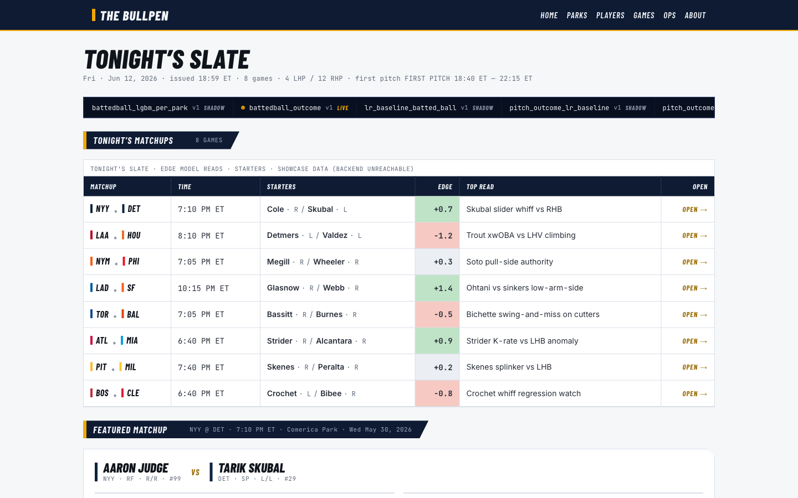
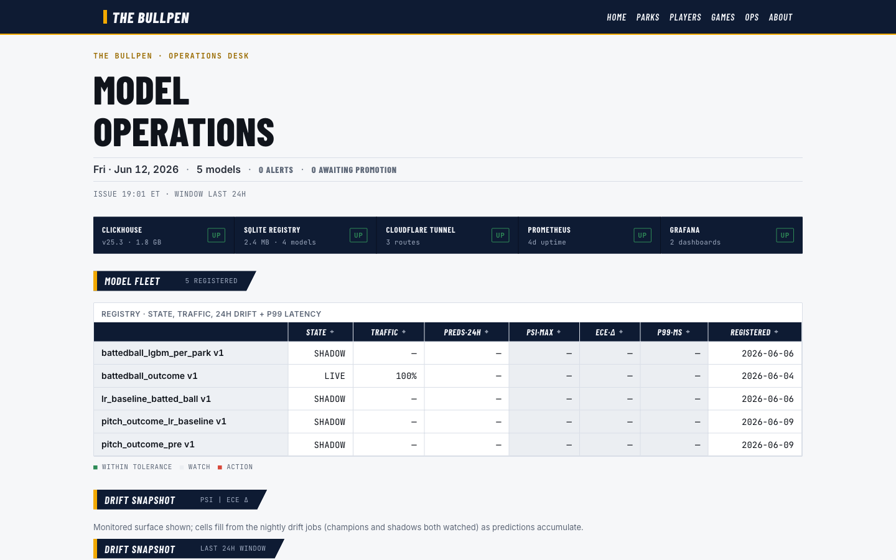
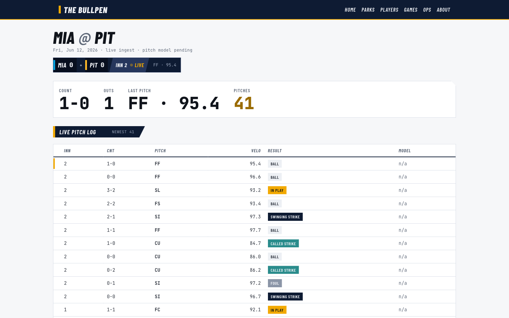
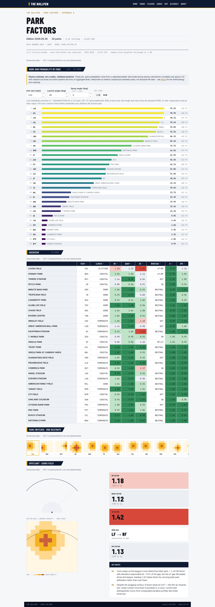
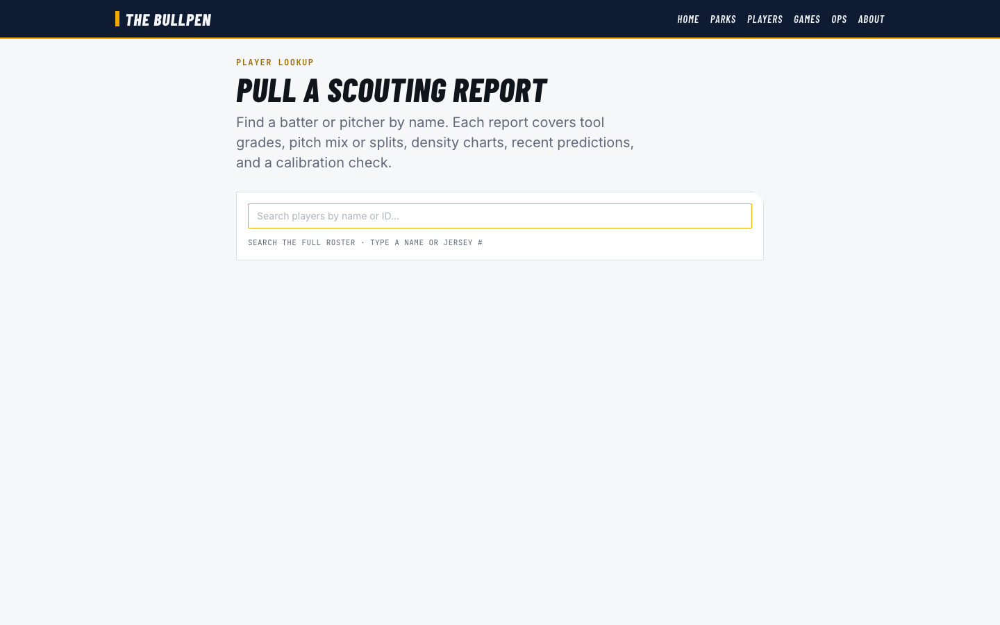
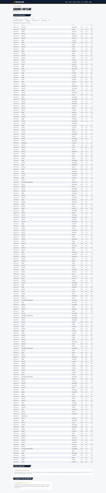
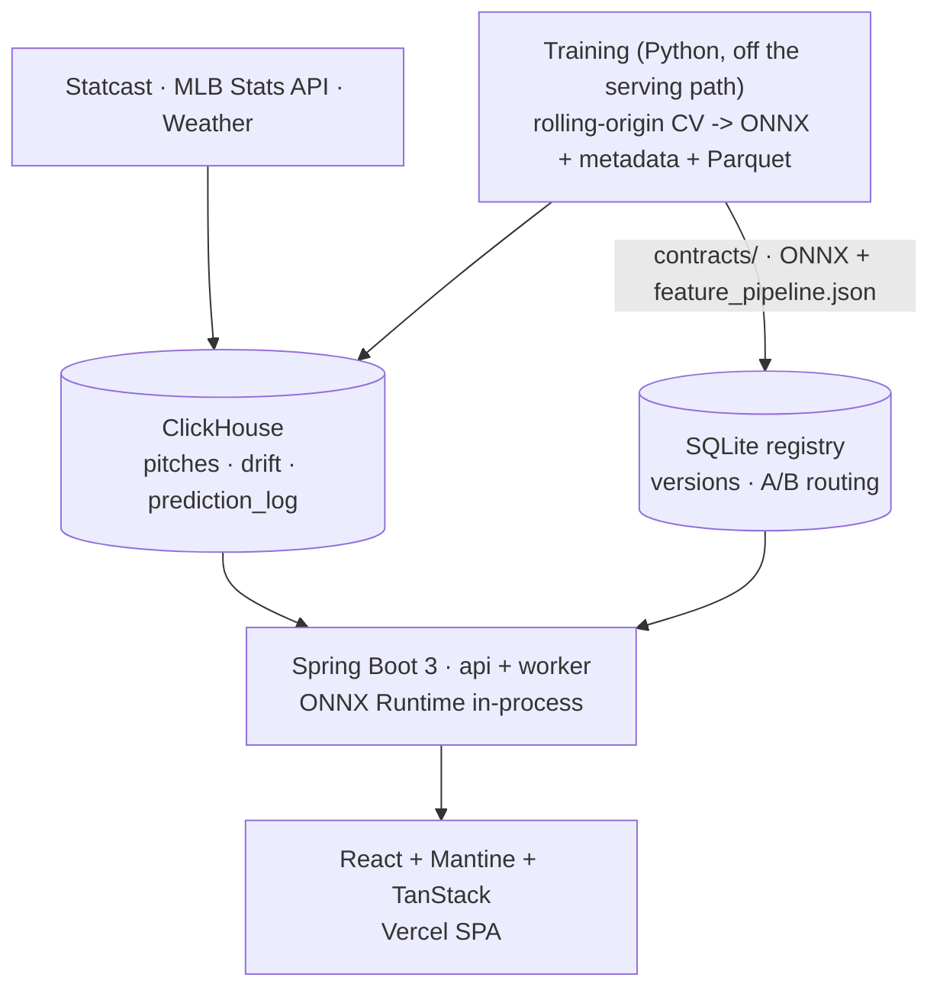
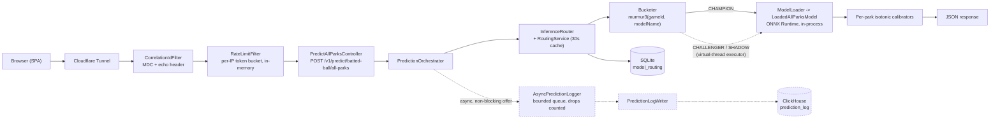
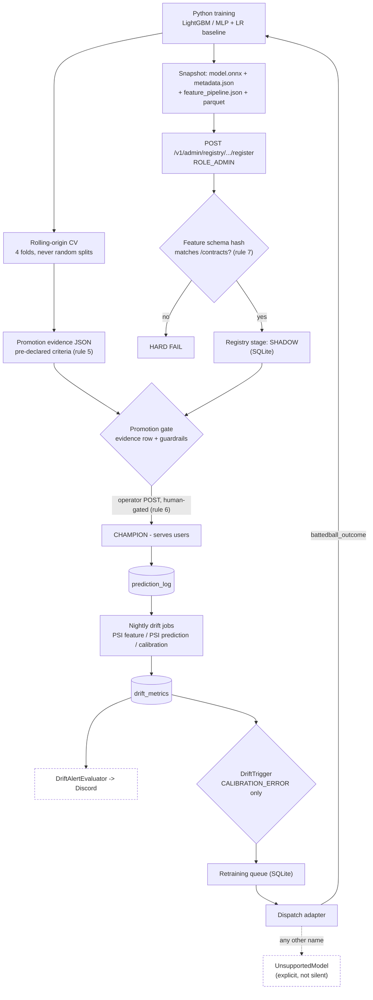

# The Bullpen

[](https://github.com/Alexm-picard/the-bullpen/actions/workflows/ci-gate.yml)
[](https://github.com/Alexm-picard/the-bullpen/actions/workflows/security.yml)
[](https://thebullpen.net)
[](LICENSE)

**[thebullpen.net](https://thebullpen.net)** is a self-hosted baseball analytics platform
built primarily as an exercise in ML systems engineering: the model registry, shadow A/B
router, drift detection, and retraining pipeline are written from scratch in Java (no
MLflow) and operate four calibrated models in production. Training is Python under strict
temporal cross-validation; serving is a Java 21 / Spring Boot 3 monolith running ONNX
Runtime in-process (no Python sidecar); the frontend is a React 19 SPA. The whole thing
runs on one self-hosted box behind a Cloudflare Tunnel and is operated like production:
monitored, alerted, backed up with rehearsed restore drills, and written up in postmortems
when it breaks - including a real one, where designed staleness detection caught two months
of silently degraded features on the live pitch path
([`2026-08-03_pitcher-form-silent-staleness.md`](docs/postmortems/2026-08-03_pitcher-form-silent-staleness.md)).

**The wrapper is the project; the models are the excuse.**

- **Live site**: https://thebullpen.net/
- **Ops dashboard**: https://thebullpen.net/ops
- **Model guide**: https://thebullpen.net/models/guide
- **Repo**: https://github.com/Alexm-picard/the-bullpen

Jump to: [the models, honestly](#the-models-honestly) ·
[architecture](#architecture) · [how this was built](#how-this-was-built) ·
[known limitations](#known-limitations) · [operating evidence](#operating-evidence)

## By the numbers

Every figure below is dated and carries its verification source; when a number here and a
linked artifact disagree, the artifact wins.

<!-- SHELF: 2026-10 docs/capacity.md (N1 section) -->

- **p99 latency 34 ms, 300 req/s** verified capacity on the single box -
  [`docs/capacity.md`](docs/capacity.md), box-confirmed.
- **One unattended retrain proven end-to-end**: a queued trigger retrained the serving
  batted-ball model on ~1.2M rows and registered the candidate in **96.8 minutes with zero
  interventions** (2026-07-15). Getting there took 16 attempts across 6 root causes, each
  fixed with a regression test - the ledger is
  [`2026-07-15_c31-retrain-saga.md`](docs/postmortems/2026-07-15_c31-retrain-saga.md).
  <!-- SHELF: 2026-11 registry evalMetrics for battedball_outcome (GET /v1/ops/registry/all) -->

- **Per-park calibration, val-2025 (n=123,345): mean ECE 0.00587 -> 0.00058 after
  isotonic, 30/30 parks improved** - registry `evalMetrics` for `battedball_outcome`.
  <!-- SHELF: 2026-11 grep -rc '@Test' backend/src/test; grep -rc 'def test_' training/tests; frontend vitest summary -->
- **2,400+ tests across three stacks** (1,000+ backend, 800+ training incl. the four
  fault-injected temporal-leakage suites, 500+ frontend) behind regression-floor coverage
  gates - counts as of 2026-08-16; read current numbers from the latest CI run.
  <!-- SHELF: 2026-11 grep -c '^`\[' docs/decisions.md; ls docs/adr/[0-9]*.md | wc -l -->
- **193 numbered decisions, 17 ADRs, 6 postmortems, 8 restore/reboot drill reports**
  (as of 2026-08-16) - [`docs/decisions.md`](docs/decisions.md), [`docs/adr/`](docs/adr/),
  [`docs/postmortems/`](docs/postmortems/), [`docs/drills/`](docs/drills/).
  <!-- SHELF: 2026-10 curl -s https://api.thebullpen.net/v3/api-docs | jq '.paths|length' -->
- **52-path REST API** (as of 2026-08-16), Schemathesis-fuzzed every CI run against the
  live `/v3/api-docs` spec.

## What's interesting about it

- A **custom ML systems wrapper** - model registry, shadow-mode A/B router, drift
  detection, retraining queue + triggers - written from scratch in Java rather than pulled
  in via MLflow. Registration hard-fails on a feature-schema-hash mismatch (rule 7);
  promotion requires a passing pre-declared evidence row and stays human-gated (rules 5
  and 6), enforced in service code and again in SQLite triggers.
- **ONNX Runtime in-process** in Java + Spring Boot 3 - no Python sidecar, no live RPC.
  Training is Python; serving is JVM. Cross-language numeric parity is tested in CI on
  both sides of the contract.
- A **drift -> postmortem chain** validated twice: first by a synthetic induced-drift
  drill (honestly labeled as such, decision [175]), then for real - two months of silent
  production feature staleness caught by a deliberately loud staleness design, root-caused,
  fixed through locked decision [186], and verified recovered with numbers
  ([`2026-08-03_pitcher-form-silent-staleness.md`](docs/postmortems/2026-08-03_pitcher-form-silent-staleness.md)).
- **Per-model eval artifacts** from rolling-origin temporal cross-validation (never random
  splits), with reliability diagrams and calibration metrics - always co-registered with a
  logistic-regression baseline to bound the bigger model's lift (rule 9).
- **Leakage discipline enforced by CI, not convention**: four required temporal-leakage
  tests (future-contamination, shuffled-target, calendar-date trace, id-consistency)
  checked by fault injection, plus a real-ClickHouse SQL-path leakage gate where a skipped
  test fails the build. 2026 season data is holdout-only, fenced at three layers (rule 13).
- **Broadcast-graphics design system** (Barlow Condensed / Inter / JetBrains Mono,
  scorebug + lower-third telecast chrome) on a dark broadcast field with a light/dark
  toggle ([191]/[192], ADR-0017). Token discipline is linted: a hex code in a component
  file fails CI.
- **Measured coverage, not a vibe**: line/branch coverage is published every CI run and
  gated on regression floors (backend JaCoCo under the Docker integration tests, frontend
  vitest v8, training coverage.py). The enforced floors live in
  `backend/build.gradle.kts`, `frontend/vite.config.ts`, and
  `.github/workflows/training.yml` - read current numbers from the latest run rather than
  figures pasted here, which drift. Each surface also gates on lint, hex-codes,
  bundle-budget, a real axe-core a11y gate (color-contrast included), and the Schemathesis
  API-contract check.

> **What's live vs. showcase (v1):** most of the app pulls real data from the Spring
> backend - the per-game detail view (`/games/:id`) including the **live next-pitch panel**
> (pre-pitch champion) and the **pitch-type panel** (calibrated prior), the player lookup +
> `/players/:id` profile, the `/parks` HR-by-park heatmap, the home page's tonight slate,
> the `/accuracy` scorecard + Live Retrospective, and the Ops dashboard's Model Fleet /
> latency / retrain queue / ops log (live via `/v1/ops/*`, with a committed-fixture
> fallback when those are empty or the backend is offline). Still pure showcase from
> `frontend/src/data/*-fixtures.ts`: the `/parks` factor table, the `/about` colophon, the
> `/players` landing's Featured Reports + Model Standouts, the `/players/:id` slug showcase
> matchup, and the Ops infra ribbon. The Ops drift snapshot is live-wired to
> `/v1/ops/drift` and renders an honest em-dash skeleton until `drift_metrics` fills in;
> drill-tagged rows are labeled so a synthetic PSI spike is never shown as organic.
> See [Known limitations](#known-limitations) for the honest caveats.

## Screenshots

The live site ([thebullpen.net](https://thebullpen.net)):

|                                Tonight's slate                                 |                                         Ops dashboard                                         |
| :----------------------------------------------------------------------------: | :-------------------------------------------------------------------------------------------: |
|   [](docs/screenshots/home.png)   |            [](docs/screenshots/ops.png)             |
|                                 **Live game**                                  |                                     **Park HR explorer**                                      |
|      [](docs/screenshots/game.png)      |   [](docs/screenshots/parks-full.jpeg)   |
|                               **Player search**                                |                                      **Player profile**                                       |
| [](docs/screenshots/players.png) | [](docs/screenshots/player-ohtani.jpeg) |

## The models, honestly

Four model families hold CHAMPION stage; each was promoted through the human-gated
evidence pipeline, and each carries the caveat its own gate defined. Live stages are
readable at `GET /v1/ops/registry/all`.

<!-- SHELF: 2026-10 GET https://api.thebullpen.net/v1/ops/registry/all (stages); decisions [141] [177] [182] [183] -->

| Family                  | What it predicts                                                                                                                   | Stage (2026-08-16)                                                                                                                                       | The honest caveat                                                                                                                                                                              |
| ----------------------- | ---------------------------------------------------------------------------------------------------------------------------------- | -------------------------------------------------------------------------------------------------------------------------------------------------------- | ---------------------------------------------------------------------------------------------------------------------------------------------------------------------------------------------- |
| `battedball_outcome` v2 | Per-park outcome probabilities for a batted ball (physics-retrodicted labels + per-park isotonic calibration, additive carry head) | CHAMPION since 2026-06-30; serves `/parks` and the game page                                                                                             | A calibrated per-park **estimate** ([141]/[163]): outcome calibration is excellent, but the cross-park HR-_ordering_ diagnostic is not yet green - see [Known limitations](#known-limitations) |
| `pitch_outcome_pre` v2  | Next-pitch outcome distribution from pre-pitch state (count, matchup, rolling form)                                                | CHAMPION since 2026-07-22 ([182]); serves the game page's next-pitch panel                                                                               | Its declared primary is absolute calibration, not accuracy (ECE 0.0009 vs the 0.02 gate, beating the LR baseline's 0.0016 - [180]/ADR-0014): a well-calibrated distribution, not an oracle     |
| `pitch_outcome_post` v1 | Refines the outcome using release / early-flight features                                                                          | CHAMPION since 2026-06-20 (gate: Brier 0.104 vs LR 0.149, ECE 0.0013); surfaced retrospectively on `/accuracy` ([177], relocated in the [191] IA rework) | Retrospective by nature - a post-pitch prediction cannot honestly be shown before the pitch. Holdout: 59.1% top-1 / 80.8% top-2 on 237,396 unseen 2026 pitches (#210 committed evidence)       |
| `pitch_type_pre` v1     | A calibrated **prior** over 7 pitch-type classes for the next pitch                                                                | CHAMPION; serves the game page's pitch-type panel                                                                                                        | Deliberately not marketed on top-1 accuracy (~0.45 - pitch selection is high-entropy). The product is the calibrated distribution, per [183]'s honest-framing constraint                       |

Each family co-registers a baseline (rule 9): `pitch_outcome_lr_baseline`,
`lr_baseline_batted_ball`, `battedball_lgbm_per_park`, and `pitch_type_lr_baseline` sit in
SHADOW/CANDIDATE stages. `battedball_outcome` v3 - the product of the 96.8-minute
unattended retrain - is registered as CANDIDATE and deliberately **not** promoted:
promotion is never automated (rule 6).

## How to try it

The simplest path is the live site above. To run it locally:

```bash
# 1. Stateful services (ClickHouse, Prometheus, Grafana). The ClickHouse container is
#    FAIL-CLOSED since decision [161] - it refuses to start without a password - so seed the
#    env FIRST, then bring the services up via the Makefile target (it renders the ClickHouse
#    users file and passes --env-file). A bare `docker compose up` fails on the required :? vars.
cp infra/.env.example infra/.env      # then set BULLPEN_CLICKHOUSE_PASSWORD + GRAFANA_ADMIN_PASSWORD
make services-up                      # render-users.sh + docker compose --env-file infra/.env up -d

# 2. Backend (api profile on 8080, worker on 8081). The Gradle wrapper lives in backend/, not root.
cd backend && ./gradlew bootRun --args='--spring.profiles.active=api'

# 3. Frontend (Vite on 5173, calls Spring via CORS)
cd ../frontend && npm install && npm run dev

# 4. Training - run the test suite (OMP_NUM_THREADS=1 avoids a macOS libomp segfault)
cd ../training && uv sync && OMP_NUM_THREADS=1 uv run python -m pytest
```

**What works with an empty stack.** The backend boots against an empty ClickHouse with no
registered ONNX model: the predict endpoints return a documented `503` (no live champion,
not a crash), and every read surface (`/v1/ops/*`, players, parks, games) falls back to
committed fixtures - so the SPA and the Ops dashboard render end-to-end before you have any
data or models. Real predictions need the historical Statcast pull plus a
trained-and-registered model, which is the self-hosted box workflow (ADR-0006), not the
local quickstart.

## Training the models

Eight registry model names - the four heads above plus four co-registered baselines.
Training runs on the self-hosted desktop only (ADR-0006: it needs the full 2015-2025
ClickHouse dataset and the GPU); the Mac runs a sampled iteration loop. **2026 is
holdout-only** (rule 13).

**All at once** - from `training/`, the full sequence (feature table ->
pitch heads + baselines -> batted-ball pipeline):

```bash
# 0. Feature table - SINGLE STAGE: tier_3_form is a standalone full build that subsumes tier_1_2
uv run python -m bullpen_training.features.tier_3_form --min-year 2015 --max-year 2025
# 1-3. Pitch heads + LR baseline (ONNX export is a separate step per head - see the runbook)
uv run python -m bullpen_training.pitch.production --model lightgbm   # -> pitch_outcome_pre
uv run python -m bullpen_training.pitch.production --model post       # -> pitch_outcome_post
uv run python -m bullpen_training.pitch.production --model lr         # -> LR baseline
# 4. Pitch-type head + its LR baseline
uv run python -m bullpen_training.pitch_type.production
# 5-6. Batted-ball MLP + LGBM baseline (retrodict -> MLP -> calibrators -> gate -> LGBM -> compare)
bash scripts/run_2c_overnight.sh
```

**In sections** - every step above is independent and idempotent, so on a box that
thermal-throttles you run one, let it cool, run the next; the batted-ball orchestrator is
itself sectionable stage-by-stage. The full procedure - prerequisites, per-stage heat/time
table, cooldown cut-points, gates, and registration - lives in
[`docs/runbooks/training-models.md`](docs/runbooks/training-models.md)
(batted-ball detail in
[`2c-overnight-pipeline.md`](docs/runbooks/2c-overnight-pipeline.md)).

## Design + decisions

Most "obvious" alternatives have been rejected with written rationale - check before
re-litigating:

- [System design](docs/design.md) - every locked technical choice with context.
- [Numbered decisions log](docs/decisions.md) - chronological append-only flat log
  (193 entries as of 2026-08-16, reversals recorded, never edited).
- [Phased build plan](docs/plan.md) - Phase 0 -> Phase 6, soft-cut priority list,
  two-week review cadence.
- [`CLAUDE.md`](CLAUDE.md) - non-negotiable discipline rules.
  <!-- SHELF: 2026-11 ls docs/adr/[0-9]*.md | wc -l -->

- ADRs (long-form, top ~15% of decisions): [`docs/adr/`](docs/adr/) - 17 as of 2026-08-16.
- [API reference](docs/api/README.md) - the live spec at
  [`/v3/api-docs`](https://api.thebullpen.net/v3/api-docs) is the source of truth and is
  Schemathesis-fuzzed every CI run; a committed snapshot rides along in
  [`docs/api/openapi.json`](docs/api/openapi.json) and is refreshed periodically.

### Architecture

Two views of the ML-systems wrapper. Both are drawn from the code, and both are
deliberately labeled where a lane is gated, partial, or drop-tolerant - a diagram that
implies more than the system does is the same defect as a stale README claim.


```mermaid
flowchart TD
    SRC["Statcast · MLB Stats API · Weather"]
    TR["Training (Python, off the serving path)<br/>rolling-origin CV -> ONNX + metadata + Parquet"]
    CH[("ClickHouse<br/>pitches · drift · prediction_log")]
    REG[("SQLite registry<br/>versions · A/B routing")]
    API["Spring Boot 3 · api + worker<br/>ONNX Runtime in-process"]
    FE["React + Mantine + TanStack<br/>Vercel SPA"]

    SRC --> CH
    TR -->|"contracts/ · ONNX + feature_pipeline.json"| REG
    TR --> CH
    CH --> API
    REG --> API
    API --> FE
```

### A predict request


```mermaid
flowchart LR
  B["Browser (SPA)"] --> CF["Cloudflare Tunnel"]
  CF --> F1["CorrelationIdFilter<br/>MDC + echo header"]
  F1 --> F2["RateLimitFilter<br/>per-IP token bucket, in-memory"]
  F2 --> C["PredictAllParksController<br/>POST /v1/predict/batted-ball/all-parks"]
  C --> O["PredictionOrchestrator"]
  O --> R["InferenceRouter<br/>+ RoutingService (30s cache)"]
  R --> BK["Bucketer<br/>murmur3(gameId, modelName)"]
  BK -->|CHAMPION| M["ModelLoader -> LoadedAllParksModel<br/>ONNX Runtime, in-process"]
  BK -.->|"CHALLENGER / SHADOW<br/>(virtual-thread executor)"| M
  M --> CAL["Per-park isotonic calibrators"]
  CAL --> RESP["JSON response"]
  O -.->|"async, non-blocking offer"| AL["AsyncPredictionLogger<br/>bounded queue, drops counted"]
  AL -.-> PLW["PredictionLogWriter"]
  PLW -.-> CH[("ClickHouse<br/>prediction_log")]
  R --> SQ[("SQLite<br/>model_routing")]

  classDef gated stroke-dasharray: 4 3
  class AL,PLW,CH gated
```

The pitch lane (`POST /v1/predict/pitch?head=pre|post`) is the same shape through
`PitchPredictionService`, which is a deliberately separate copy of that skeleton rather
than a shared orchestrator; the pitch-type lane (`POST /v1/predict/pitch-type`) mirrors it
through `PitchTypePredictionService`. `POST /v1/simulate/**` is neither routed nor logged:
it pins one artifact on purpose as an unrouted diagnostic (decision [176]). Prediction
logging is best-effort by design - the queue drops under saturation rather than adding
latency to the response, and the writer bean does not exist at all when ClickHouse is
disabled.

### The model lifecycle


```mermaid
flowchart TD
  T["Python training<br/>LightGBM / MLP + LR baseline"] --> EV["Rolling-origin CV<br/>4 folds, never random splits"]
  EV --> EVD["Promotion evidence JSON<br/>pre-declared criteria (rule 5)"]
  T --> SNAP["Snapshot: model.onnx + metadata.json<br/>+ feature_pipeline.json + parquet"]
  SNAP --> REG["POST /v1/admin/registry/.../register<br/>ROLE_ADMIN"]
  REG --> HASH{"Feature schema hash<br/>matches /contracts? (rule 7)"}
  HASH -->|no| FAIL["HARD FAIL"]
  HASH -->|yes| SHADOW["Registry stage: SHADOW<br/>(SQLite)"]
  EVD --> GATE
  SHADOW --> GATE{"Promotion gate<br/>evidence row + guardrails"}
  GATE -->|"operator POST, human-gated (rule 6)"| CHAMP["CHAMPION - serves users"]
  CHAMP --> PL[("prediction_log")]
  PL --> DJ["Nightly drift jobs<br/>PSI feature / PSI prediction / calibration"]
  DJ --> DM[("drift_metrics")]
  DM --> AL2["DriftAlertEvaluator -> Discord"]
  DM --> DT{"DriftTrigger<br/>CALIBRATION_ERROR only"}
  DT --> Q["Retraining queue (SQLite)"]
  Q --> DISP["Dispatch adapter"]
  DISP -->|"battedball_outcome"| T
  DISP -.->|"any other name"| UNS["UnsupportedModel<br/>(explicit, not silent)"]

  classDef stop fill:none,stroke-dasharray: 4 3
  class UNS,AL2 stop
```

Two honest details the diagram encodes rather than hides. **Feature PSI is terminal at the
alert**: only calibration error can enqueue a retrain, so a PSI spike pages a human and
stops there. And **dispatch is one model deep** - `battedball_outcome` retrains end-to-end
(proven once, unattended, in 96.8 minutes), while every other registry name raises an
explicit `UnsupportedModel` rather than pretending to be wired. Promotion is never
automated: the only path to CHAMPION is an authenticated operator call.

## How this was built

The Bullpen is a solo project, built with AI assistance, and I want to be exact about what
that means - because "AI-assisted" covers everything from "it wrote my README" to "it made
every decision for me," and this is neither.

<!-- SHELF: 2026-11 grep -c '^`\[' docs/decisions.md; ls docs/adr/[0-9]*.md | wc -l -->

**What I owned.** Every architectural decision on this project is mine, and every one is
written down. The 17 ADRs and 193 numbered decision-log entries (as of 2026-08-16) aren't
documentation I generated after the fact - they're the actual record of choices I made and
defended: why ONNX Runtime in-process instead of a Python sidecar, why a shared-kernel read
model instead of boundary mappers, why the pre-pitch head's promotion gate is calibration
and not accuracy, why the model registry enforces promotion criteria at both the service
and database level. Each entry captures a real fork, the alternatives I rejected, and the
reason. When I changed my mind (the storage vendor, a promotion metric, the dark-field
toggle) I recorded the reversal rather than editing history. That log is the thinking, and
it's mine.

**How the AI was used.** I worked with Claude as a pair - an implementer and a reviewer I
directed. It wrote code under my design, drafted docs I rewrote, and ran the review agents
I built (a leakage auditor for the training code, a registry guard for promotion
discipline). I reviewed what it produced the way I'd review a teammate's PR: I caught the
bugs, I rejected the ceremony, I made the calls it deferred to me. The Co-Authored-By
trailers in the git history are honest - the AI co-authored the code. It did not co-author
the judgment.

**Why I'm telling you this instead of hiding it.** Because the interesting engineering in
2026 isn't "did a human type every line" - it's "can you direct this kind of collaboration
and stay in control of the outcome." The discipline artifacts on this project are the
evidence that I did: the append-only decision log, the CI gates I can't override, the
leakage tests that fail the build, the promotion gate no model skips, the failure ledgers
(there's a 16-attempt retrain saga written up honestly, not sanded down). Those exist
because I insisted on them, and they're what kept an AI-accelerated build from becoming an
AI-shaped mess.

If you want to probe this, open the decision log and ask me about any entry. I can tell
you what I was choosing between and why - because I chose it.

## Data sources + licensing

The code in this repository is released under the [MIT License](LICENSE). That covers the
code only - it grants no rights to the underlying MLB data, whose terms are separate (see
below).

Pitch-level data is downloaded from
[Baseball Savant](https://baseballsavant.mlb.com/) via the
[`pybaseball`](https://pypi.org/project/pybaseball/) client. Roster and game schedule come
from the MLB Stats API. Weather joins from a free meteorology source.

**This project's published outputs (predictions, model artifacts, this site) are derived
analytics for personal research / portfolio purposes. Underlying play-by-play data is not
redistributed.**

## Known limitations

- **Live vs. showcase is mixed** (v1) - the split is itemized in the
  ["What's live vs. showcase" box above](#whats-interesting-about-it), and every showcase
  surface is labeled as such in the UI itself.
  <!-- SHELF: 2026-11 training/data/cross_park_sanity_report.json + physics_validation_report.json; docs/cross-park-fidelity-plan.md -->
- **Cross-park batted-ball fidelity is a known limitation.**
  `/v1/predict/batted-ball/all-parks` is served by the registered batted-ball champion
  across the 30 parks. The ball-flight physics validation passes (bias -0.14 ft, 93% of
  fixtures within tolerance) - but that is **still-air carry reconstruction**, not
  real-weather cross-park fidelity. The cross-park HR-ordering sanity diagnostic does
  **not** pass yet: predicted per-park HR rates correlate only Spearman rho 0.333 with the
  observed park-factor ordering (the physics labels themselves only reach ~0.30, so the
  model faithfully reproduces weak labels - decision [141]; interim target
  observed-normalized rho >= 0.65 per [140]; it is a non-blocking diagnostic, and
  registration gates on per-park outcome ECE instead). The away-park counterfactual
  currently uses ADR-0010's **still-air interim** (destination seasonal temp/density +
  altitude, **no wind**); the real per-date weather + wind backfill (`park_daily_weather`)
  that should lift the ordering is staged but not yet shipped. Treat per-park batted-ball
  numbers as directional, not calibrated, until that gate is green - see
  [`docs/cross-park-fidelity-plan.md`](docs/cross-park-fidelity-plan.md). The `/parks`
  heatmap and the model guide surface this physics-estimate framing (and the rho gap)
  directly to users rather than presenting raw P(HR) as fact (decision [163]).
- **Automated retraining is wired and proven, but only one model deep.**
  `battedball_outcome` retrains end-to-end (the 2026-07-15 unattended proof above); every
  other registry name raises an explicit `UnsupportedModel`. The unattended systemd-timer
  path also remains - the manual ceremony is the proven one. On the drift side, all three
  signals are real and ClickHouse-backed (PSI-on-predictions, calibration-vs-observed,
  per-feature PSI against a training-time baseline), and a champion promoted without a
  baseline trips a loud `DriftBaselineMissing` alert rather than silently skipping.
- **The live pitch path is flag-gated but proven in operation.** The poller chain (MLB
  Stats API client + parser + per-game poll + `pitches_live` writer + the `prediction_log`
  truth-join by `(game_id, at_bat_index, pitch_number)`) is enabled in prod behind
  `BULLPEN_INGEST_LIVE_ENABLED` (decision [157]) and has operated against the real MLB
  feed - the wiring issue closed completed
  ([#1](https://github.com/Alexm-picard/the-bullpen/issues/1)), and the flagship staleness
  postmortem above is operating evidence from this very path
  ([runbook](docs/runbooks/live-data-setup.md)). The honest residue (decision [186]): the
  historical `pitches` corpus is manually backfilled with no live-to-historical promotion
  job (window queries read the union of `pitches` and `pitches_live`), and per-player
  history / calibration views populate as live predictions accrue.
- **Playwright e2e is route-mocked.** It covers the live pages (both populated and empty
  pitch-log states) and runs a real axe-core accessibility gate in CI, but against mocked
  routes on a production build, not a live backend; static linters (hex codes, bundle
  budget) run alongside. Lighthouse performance budgets are the remaining CI add.

## What's next (v1.5)

- Cross-park batted-ball fidelity: ship the `park_daily_weather` backfill and get the
  per-park HR-ordering diagnostic green (observed-normalized Spearman rho >= 0.65, interim
  per decision [140]) - see `docs/cross-park-fidelity-plan.md`
- Batted-ball physics: the launch-angle carry gradient investigation (Magnus over-lift at
  low launch angles / under-carry at high -
  [#24](https://github.com/Alexm-picard/the-bullpen/issues/24))
- Hyperparameter search in the retraining job (fixed-HP today per decision [81])
- Per-game weather pull replacing the per-park annual default atmosphere (Phase 2c.4)

## Operating evidence

- **Drift postmortems** land under [`docs/postmortems/`](docs/postmortems/) when a model
  degrades and the human review writes one up. The flagship Phase-6 artifact is the REAL
  one:
  [`2026-08-03_pitcher-form-silent-staleness.md`](docs/postmortems/2026-08-03_pitcher-form-silent-staleness.md) -
  two months of silent Tier-3 form staleness on the live pitch path, detected by a
  deliberately data-anchored staleness refusal, root-caused to an unowned freshness
  assumption, fixed through locked decision [186] with parity-tested queries, and verified
  recovered with numbers. It executes [169]'s natural-event-supersedes clause over the
  earlier honestly-labeled synthetic induced-drift drill ([175],
  [`2026-07-16_induced-drift-drill.md`](docs/postmortems/2026-07-16_induced-drift-drill.md) -
  now the drill report that proved the detector had teeth before the real event arrived).
  An earlier pre-season drill
  ([`drill-2026-05-30-induced-battedball-drift.md`](docs/postmortems/drill-2026-05-30-induced-battedball-drift.md),
  PSI 0.912, ECE 0.188) and the first-organic-PSI triage
  ([`2026-07-16_first-organic-psi-triage.md`](docs/postmortems/2026-07-16_first-organic-psi-triage.md))
  round out the drift ledger.
- **Restore + reboot drill reports** under [`docs/drills/`](docs/drills/) (rule 8) - the
  failures are committed alongside the passes. The 2026-08-09 gating restore-from-R2 drill
  FAILED first (it found two champion artifacts with zero bytes offsite), was fixed
  same-day, and re-ran to a measured PASS - which is exactly what drills are for.
- **Hardening sweeps** (Phase 5.5) - running observations in
  [`docs/hardening/observations.md`](docs/hardening/observations.md), triaged into dated
  sweep docs with measured before/after per item. First one:
  [`2026-05-30_sweep.md`](docs/hardening/2026-05-30_sweep.md) (11 items - CI red -> green,
  2 Schemathesis-found 500s -> 400, TS strict 67 -> 0, raw-SQL leak 1 -> 0, perf
  baselines, the drift-chain validation).
- **Capacity + limits** - measured ceilings with named bottlenecks in
  [`docs/capacity.md`](docs/capacity.md).
- **Hiring readiness** (Phase 6) - deliverables tracked in [`docs/hiring/`](docs/hiring/).

## Repository layout

```
thebullpen/
├── backend/        Java 21 + Spring Boot 3 (Gradle Kotlin DSL)
├── training/       Python 3.11 (uv) - model training, eval, ONNX export
├── frontend/       React 19 + TypeScript + Vite + Mantine 9 + Tailwind 4
├── contracts/      Canonical Python↔Java file contract
├── infra/          docker-compose, Prometheus + Grafana, backup scripts
├── docs/           design.md, plan.md, decisions.md, adr/, drills/, etc.
├── .githooks/      pre-commit (schema_hash discipline)
└── deploy.sh       real WSL2 deploy (clean-tree guard, atomic symlink swap,
                    health smoke + rollback, release tag) - prefer deploy-safely
```

## Contact

GitHub: [@Alexm-picard](https://github.com/Alexm-picard)
